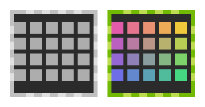

# nvtray

NVIDIA GPU activity tray icon for Linux — like the classic Windows
"GPU Activity" notification icon: a gray chip in the system tray that
lights up with a rainbow gradient while the GPU is under load.



## Features

- Sits in the system tray via the StatusNotifierItem protocol
  (works natively on KDE Plasma / Wayland, GNOME with an SNI extension, etc.)
- Polls GPU utilization once per second through NVML
  (`libnvidia-ml.so`, no `nvidia-smi` spawning) — 0% CPU when idle
- Icon appears only while an NVIDIA GPU is present in the system;
  unplug the eGPU / unload the driver and the icon disappears,
  plug it back and it returns automatically
- Tooltip shows GPU and memory-controller utilization
- Single small static-ish binary (~3 MB)

## Build

```sh
cargo build --release
```

The binary is `target/release/nvtray`. Just run it — no arguments,
no configuration. Right-click the icon for a Quit entry.

## Autostart

KDE Plasma: System Settings → Autostart, or drop a desktop file into
`~/.config/autostart/`. The AUR package installs
`/usr/share/applications/nvtray.desktop` that can be enabled there.

## Dependencies

- Runtime: NVIDIA proprietary driver (`libnvidia-ml.so.1`, `nvidia-utils` on Arch)
- Build: Rust toolchain (`cargo`)

## License

GNU General Public License v3.0 or later — see [LICENSE](LICENSE).
